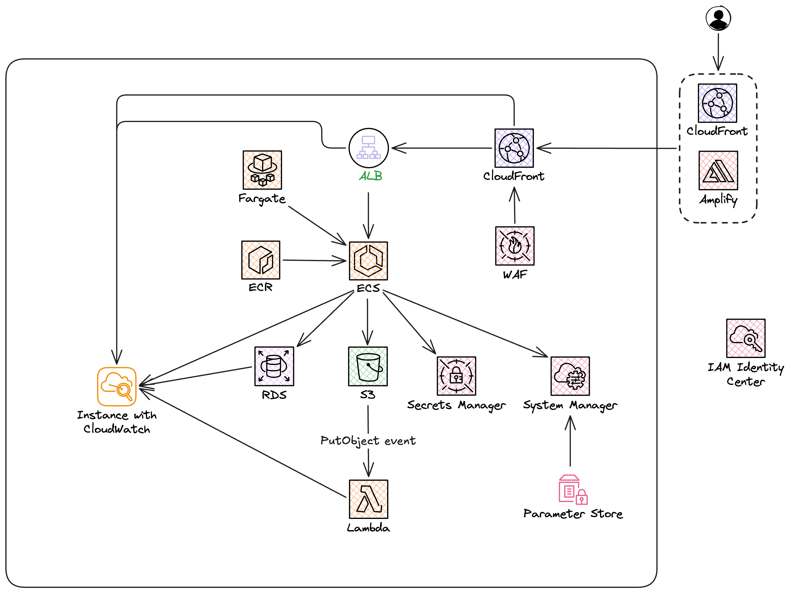

# Deploy Private Presigned Images to S3 (ECS + Lambda)

Cette partie decrit les etapes pour deployer le backend avec images privees sur S3 et URLs presignees.

## 1) Prerequis

- Bucket S3: `cloud-nova-images`
- Repository ECR: `<ACCOUNT.ID>.dkr.ecr.eu-west-1.amazonaws.com/nova/core`
- Service ECS Fargate derriere ALB
- Role IAM ECS Task Role: `ecsTaskRole`
- Lambda resizer + role d'execution: `nova-image-resizer-role-...`
- AWS CLI + Docker Desktop

## 2) Variables d'environnement

### ECS (Task Definition)

- `DRIVE_DISK=s3`
- `AWS_REGION=eu-west-1`
- `S3_BUCKET=cloud-nova-images`
- `PORT=8080`
- `HOST=0.0.0.0`

Non definies en prod ECS:

- `AWS_ACCESS_KEY_ID`
- `AWS_SECRET_ACCESS_KEY`
- `S3_ENDPOINT`

### Lambda resizer

La lambda fournie (`S3Client({})`) utilise le role IAM et n'impose pas de variable obligatoire.

## 3) IAM - recapitulatif permissions

### ECS Task Role (`ecsTaskRole`)

- `s3:ListBucket` sur `cloud-nova-images`
- `s3:GetObject`, `s3:PutObject`, `s3:DeleteObject` sur `cloud-nova-images/uploads/*`
- `s3:GetObject` sur `cloud-nova-images/resized/*`

### Lambda execution role (`nova-image-resizer-role-...`)

- `s3:GetObject` sur `cloud-nova-images/uploads/*`
- `s3:PutObject` sur `cloud-nova-images/resized/*`
- CloudWatch Logs (policy AWSLambdaBasicExecutionRole)

### Lambda resource-based policy

- Principal `s3.amazonaws.com`
- Action `lambda:InvokeFunction`
- SourceArn `arn:aws:s3:::cloud-nova-images`
- SourceAccount `<ACCOUNT.ID>`

## 4) Bucket S3

- Bucket: `cloud-nova-images`
- Block Public Access: ON
- Aucune policy publique
- Notification d'evenement vers lambda:
  - Event: `s3:ObjectCreated:Put`
  - Prefix: `uploads/`
  - Target: `nova-image-resizer`

Policy de compartiment:

```json
{
  "Version": "2012-10-17",
  "Statement": [
    {
      "Sid": "ReadOriginals",
      "Effect": "Allow",
      "Principal": {
        "AWS": "arn:aws:iam::<ACCOUNT.ID>:role/service-role/nova-image-resizer-role-i6qn8cmd"
      },
      "Action": "s3:GetObject",
      "Resource": "arn:aws:s3:::cloud-nova-images/uploads/*"
    },
    {
      "Sid": "WriteResized",
      "Effect": "Allow",
      "Principal": {
        "AWS": "arn:aws:iam::<ACCOUNT.ID>:role/service-role/nova-image-resizer-role-i6qn8cmd"
      },
      "Action": "s3:PutObject",
      "Resource": "arn:aws:s3:::cloud-nova-images/resized/*"
    },
    {
      "Sid": "EcsUploadsWriteReadDelete",
      "Effect": "Allow",
      "Principal": {
        "AWS": "arn:aws:iam::<ACCOUNT.ID>:role/ecsTaskRole"
      },
      "Action": ["s3:GetObject", "s3:PutObject", "s3:DeleteObject"],
      "Resource": "arn:aws:s3:::cloud-nova-images/uploads/*"
    },
    {
      "Sid": "EcsReadResized",
      "Effect": "Allow",
      "Principal": {
        "AWS": "arn:aws:iam::<ACCOUNT.ID>:role/ecsTaskRole"
      },
      "Action": "s3:GetObject",
      "Resource": "arn:aws:s3:::cloud-nova-images/resized/*"
    }
  ]
}
```

## 5) Build et push image ECR

```bash
aws ecr get-login-password --region eu-west-1 | docker login --username AWS --password-stdin <ACCOUNT.ID>.dkr.ecr.eu-west-1.amazonaws.com
docker build --pull --no-cache -t nova-core:private-s3 .
docker tag nova-core:private-s3 <ACCOUNT.ID>.dkr.ecr.eu-west-1.amazonaws.com/nova/core:private-s3-v5
docker push <ACCOUNT.ID>.dkr.ecr.eu-west-1.amazonaws.com/nova/core:private-s3-v5
```

## 6) Deploiement ECS

1. Creer une nouvelle revision de Task Definition
2. Mettre a jour:
   - image `.../nova/core:private-s3-v5`
   - port conteneur `8080/TCP`
   - variables d'environnement
   - `taskRoleArn=ecsTaskRole`
3. Mettre a jour le service ECS
4. Forcer un nouveau deploiement

## 7) Deploiement Lambda resizer

1. Deployer le code lambda
2. Verifier le trigger S3 (`uploads/`, `s3:ObjectCreated:Put`)
3. Verifier les permissions du role d'execution (lecture `uploads/*`, ecriture `resized/*`)
4. Verifier la permission resource-based `lambda:InvokeFunction` pour S3

## 8) Flow image cible (upload -> resize -> read)

1. Le backend ecrit en prive sous `uploads/`, ex: `uploads/post-<uuid>.png`
2. S3 declenche la lambda resizer
3. La lambda ecrit en prive sous `resized/`, ex: `resized/post-<uuid>.jpg`
4. Au GET API:
   - lecture prioritaire `resized/...`
   - fallback `uploads/...` si resized indisponible
5. Le frontend lit toujours `image`/`avatar` avec URL presignee (TTL 15 min)

## 9) Verification post-deploiement

1. Upload via endpoint API
2. Verification objet source dans `uploads/`
3. Verification objet transforme dans `resized/`
4. Verification URL presignee (`X-Amz-Signature`, `X-Amz-Expires=900`)
5. Verification acces direct non signe -> `403 AccessDenied`
6. Verification expiration (~15 min) puis refetch API

## 10) Depannage rapide

- `AccessDenied` upload:
  - verifier policy sur `ecsTaskRole`
  - verifier `S3_BUCKET`, `AWS_REGION`
  - verifier revision ECS active

- `AccessDenied` lambda:
  - verifier role `nova-image-resizer-role-...` (Get uploads / Put resized)
  - verifier policy bucket et trigger S3

- Pas de fichier dans `resized/`:
  - verifier trigger prefix `uploads/`
  - verifier logs CloudWatch `/aws/lambda/nova-image-resizer`

- Meme digest ECR sur plusieurs tags:
  - rebuild avec `--pull --no-cache`
