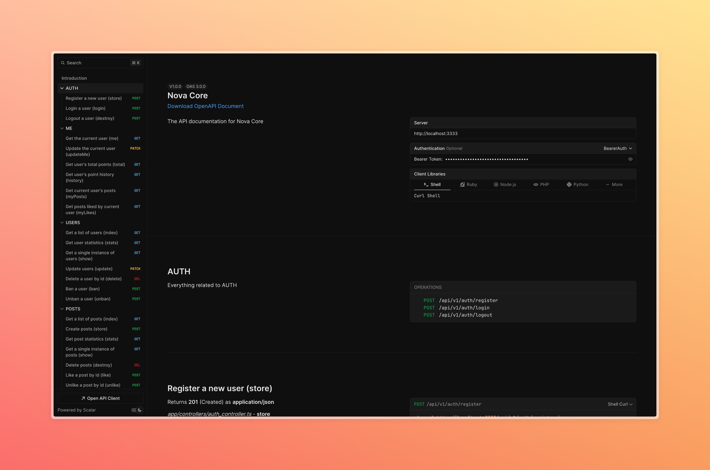

# Nova Core

<div align="center">
  
</div>

A modern, full-featured backend application built with AdonisJS, featuring authentication, file storage, and database management.

## 🚀 Features

- **Authentication System**: Built-in user authentication and authorization
- **File Storage**: S3-compatible storage using MinIO
- **Database**: PostgreSQL database with Adminer UI for management
- **API Documentation**: Auto-generated Swagger documentation
- **TypeScript Support**: Full TypeScript implementation
- **Docker Support**: Containerized development environment
- **Testing**: Built-in testing framework with Japa
- **Code Quality**: ESLint and Prettier for code formatting and linting
- **Real-time Communication**: WebSocket support for online status and private messaging

## 📋 Prerequisites

- Node.js (Latest LTS version recommended)
- Docker and Docker Compose
- pnpm (Package manager)

## 🛠️ Installation

1. Clone the repository:

```bash
git clone <repository-url>
cd nova-core
```

2. Install dependencies:

```bash
pnpm install
```

3. Create a `.env` file in the root directory with the following variables:

```env
DB_USER=your_db_user
DB_PASSWORD=your_db_password
DB_DATABASE=your_db_name
MINIO_ROOT_USER=admin
MINIO_ROOT_PASSWORD=password
S3_BUCKET=your-bucket-name
```

4. Start the development environment:

```bash
docker-compose up -d
```

5. Run database migrations:

```bash
node ace migration:run
```

6. (Optional) Seed the database with initial data:

```bash
node ace db:seed
```

## 🚀 Development

Start the development server:

```bash
pnpm dev
```

For Hot Module Replacement (HMR):

```bash
pnpm dev:hmr
```

## 📝 Available Scripts

- `pnpm start` - Start the production server
- `pnpm build` - Build the application
- `pnpm dev` - Start development server
- `pnpm dev:hmr` - Start development server with HMR
- `pnpm test` - Run tests
- `pnpm lint` - Run ESLint
- `pnpm format` - Format code with Prettier
- `pnpm typecheck` - Run TypeScript type checking

## 🗄️ Infrastructure

The application uses Docker Compose to manage the following services:

- **PostgreSQL**: Database server (port 5432)
- **Adminer**: Database management UI (port 8080)
- **MinIO**: S3-compatible object storage
  - API endpoint: port 9000
  - Console UI: port 9001

## 📚 API Documentation

API documentation is automatically generated using Swagger. Access it at:

```
http://localhost:3333/docs
```



## 🔌 WebSocket Documentation

The application uses Socket.IO for real-time communication. Here are the available features:

### User Online Status

```typescript
// Connect to WebSocket server
const socket = io('http://localhost:3333', {
  auth: { userId: currentUserId },
})

// Listen for user status changes
socket.on('user:status', ({ userId, isOnline }) => {
  console.log(`User ${userId} is ${isOnline ? 'online' : 'offline'}`)
})
```

### Private Messaging

The application supports real-time private messaging between users. Here are the available events:

#### Sending Messages

```typescript
// Send a private message
socket.emit('private:message', {
  receiverId: otherUserId,
  content: 'Hello!',
})

// Listen for sent confirmation
socket.on('private:message:sent', (message) => {
  console.log('Message sent:', message)
})
```

#### Receiving Messages

```typescript
// Listen for incoming messages
socket.on('private:message', (message) => {
  console.log('New message:', message)
})
```

#### Message Read Status

```typescript
// Mark messages as read
socket.emit('private:message:read', {
  senderId: otherUserId,
})

// Listen for read receipts
socket.on('private:message:read', ({ readerId }) => {
  console.log('Messages read by:', readerId)
})
```

#### Typing Indicators

```typescript
// Send typing status
socket.emit('private:typing', {
  receiverId: otherUserId,
})

// Listen for typing status
socket.on('private:typing', ({ userId }) => {
  console.log('User typing:', userId)
})
```

### REST API Endpoints

Private messaging also includes REST endpoints for managing messages:

- `GET /api/v1/messages/conversation?userId=:userId&otherUserId=:otherUserId`

  - Get conversation history between two users

- `POST /api/v1/messages/mark-as-read`

  - Mark messages as read
  - Body: `{ userId: number, senderId: number }`

- `GET /api/v1/messages/unread-count?userId=:userId`
  - Get number of unread messages for a user

All endpoints require authentication using Bearer token.

## 🧪 Testing

Run the test suite:

```bash
pnpm test
```

## 📦 Project Structure

```
nova-core/
├── app/              # Application code
│   ├── controllers/  # Route controllers
│   ├── models/       # Database models
│   ├── middleware/   # Custom middleware
│   └── services/     # Business logic
├── config/           # Configuration files
├── database/         # Database migrations and seeds
├── start/            # Application startup files
└── tests/            # Test files
```

## 🔒 Security

- Environment variables are used for sensitive configuration
- Authentication is handled through @adonisjs/auth
- CORS is configured through @adonisjs/cors
- Input validation using VineJS

## 🤝 Contributing

1. Fork the repository
2. Create your feature branch (`git checkout -b feature/amazing-feature`)
3. Commit your changes (`git commit -m 'Add some amazing feature'`)
4. Push to the branch (`git push origin feature/amazing-feature`)
5. Open a Pull Request

## 📄 License

This project is private and unlicensed.

## 👥 Authors

- [@Sagbyy](https://github.com/Sagbyy)
- [@madoxSio](https://github.com/madoxSio)

## 🙏 Acknowledgments

- AdonisJS team for the amazing framework
- All contributors who have helped shape this project
